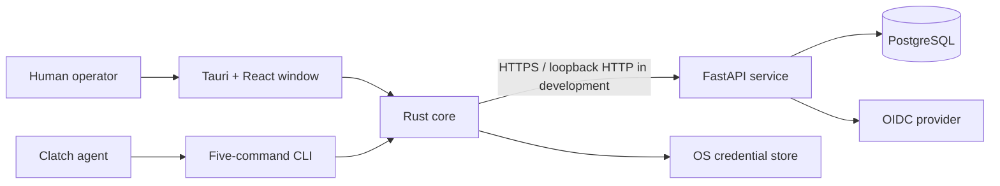

# Quayt

[](https://github.com/breksos/Quayt-clapp/actions/workflows/build.yml)

Quayt is a native desktop workspace for port and terminal operations. The current development
release provides secure OIDC sign-in, tenant selection, and a read-only vessel-call dashboard with
summary counts, detail views, and bounded filters.

Quayt is built as a Clatch clapp. A single Rust binary powers the human-facing Tauri window and a
deliberately narrow agent CLI, while a separate FastAPI and PostgreSQL service remains the
authoritative source of operational data.

> **Project status:** Phase 3 development preview. Quayt is not a production release and does not
> yet support operational writes, external integrations, deployment, signing, or public
> distribution.

## What works today

- Browser-based OIDC authorization with PKCE, state, and nonce binding
- Revocable, refreshable device sessions stored as keyed hashes by the service
- OS credential-store handling for desktop credentials
- Server-verified tenant membership and explicit tenant selection
- Read-only vessel-call list, summary, and detail APIs
- Filters for status, vessel or IMO search, and ETA range
- Accessible loading, empty, error, retry, and workspace states
- Deterministic fictional development data and an OIDC-compatible demo provisioner
- Forced PostgreSQL row-level security for tenant-owned vessel calls
- Request-generation guards that prevent stale tenant data after workspace changes
- A five-command agent CLI that excludes operational data and credentials

The following workflows are intentionally outside the current scope: vessel-call creation or
updates, container tracking, finance, notifications, mobile clients, offline writes, legacy-data
migration, and production infrastructure.

## Architecture



The Rust core owns desktop state and is shared by the GUI and CLI. Operational vessel-call data is
available only to the GUI projection. The CLI snapshot contains connection and authentication
status, never credentials or vessel-call records. The service derives tenant context from a
revalidated session and applies both explicit tenant predicates and PostgreSQL row-level security.

## Repository layout

| Path | Purpose |
| --- | --- |
| `src/` | React workspace and desktop UI |
| `src-tauri/` | Rust core, Tauri host, OIDC flow, credential handling, and CLI |
| `service/` | FastAPI service, PostgreSQL models, migrations, seeds, and tests |
| `qa/` | Dependency-free phase acceptance checks |
| `docs/` | Architecture decisions, security reviews, QA evidence, and release gates |
| `clappkit/` | Pinned ClappKit Git submodule; do not edit it for Quayt behavior |
| `clatch.json` | Clatch package and CLI contract |

## Prerequisites

- Git with submodule support
- Node.js 22 and npm
- Rust 1.85.1 with Cargo
- Python 3.11
- PostgreSQL 17, directly or through Docker Compose
- A loopback-capable development OIDC provider
- Clatch for manifest validation, installation, and CLI use

The pinned versions used by CI are recorded in [the build workflow](.github/workflows/build.yml).

## Clone and install dependencies

```sh
git clone --recurse-submodules https://github.com/breksos/Quayt-clapp.git
cd Quayt-clapp
npm ci

python3.11 -m venv service/.venv
service/.venv/bin/python -m pip install --upgrade pip==25.0.1
service/.venv/bin/python -m pip install -r service/requirements.lock
service/.venv/bin/python -m pip install --no-deps -e './service[dev]'
```

If the repository was cloned without submodules, initialize ClappKit with:

```sh
git submodule update --init --recursive
```

## Configure the development service

Copy the environment template and replace every `REPLACE_WITH_...` value with metadata from your
development OIDC provider:

```sh
cp .env.example .env
```

Generate the local session-hash key with:

```sh
python3 -c 'import base64, secrets; print(base64.urlsafe_b64encode(secrets.token_bytes(32)).decode().rstrip("="))'
```

The OIDC client must accept dynamic loopback callbacks matching
`http://127.0.0.1:<ephemeral-port>/oidc/callback`. Development permits HTTPS endpoints or loopback
HTTP; production configuration fails closed unless identity endpoints use HTTPS.

Start PostgreSQL, load the environment, apply migrations, and run the service:

```sh
docker compose -f compose.dev.yml up -d postgres
set -a; . ./.env; set +a

(cd service && ../service/.venv/bin/alembic upgrade head)
(cd service && ../service/.venv/bin/alembic check)
service/.venv/bin/quayt-service
```

The development service listens on `http://127.0.0.1:8080`.

### Create a local demo workspace

After configuring the OIDC provider, provision the exact `sub` claim of a development user:

```sh
set -a; . ./.env; set +a
service/.venv/bin/quayt-provision-demo --subject '<OIDC subject claim>'
```

This command is idempotent. It creates an active fictional tenant and membership and loads the
deterministic vessel-call dataset. It refuses to run outside `QUAYT_ENV=development`, does not mint
a session, and does not bypass the normal OIDC sign-in flow.

To seed an already existing development tenant directly:

```sh
service/.venv/bin/quayt-seed-vessel-calls --tenant-id '<tenant UUID>'
```

## Run the desktop app

For native development with hot reload:

```sh
npx tauri dev
```

Enter `http://127.0.0.1:8080` as the service URL in the Quayt window, sign in through the configured
OIDC provider, and select the provisioned tenant.

To build the host binary, validate it, and install the source folder with Clatch:

```sh
npm run build
clatch validate .
clatch install .
clatch run com.arfium.quayt
```

`npm run build` stages the executable at `bin/quayt`, which is the path declared by
`clatch.json`.

## Agent CLI

Quayt exposes exactly five commands:

| Command | Purpose |
| --- | --- |
| `quayt status` | Show the safe connection and authentication snapshot |
| `quayt show` | Show the desktop window |
| `quayt hide` | Hide the desktop window |
| `quayt quit` | Quit Quayt |
| `quayt ping` | Check whether Quayt is running |

Authentication remains a human-window action. The CLI cannot initiate login, select tenants, or
read vessel-call data. The current manifest emits no Clatch signals.

## API surface

The service exposes versioned authentication/session endpoints under `/api/v1` and these
authenticated vessel-call endpoints:

- `GET /api/v1/vessel-calls`
- `GET /api/v1/vessel-calls/summary`
- `GET /api/v1/vessel-calls/{vessel_call_id}`

Operational responses use explicit cache-prevention headers. Foreign-tenant details return a
generic not-found response, and malformed or unbounded filters are rejected.

## Verification

Run the local gates from the repository root:

```sh
npm run validate:manifest
clatch validate .

python3 qa/phase1_acceptance.py
python3 qa/phase2_acceptance.py
python3 qa/phase3_acceptance.py

npm run build:web
cargo fmt --manifest-path src-tauri/Cargo.toml --check
cargo test --manifest-path src-tauri/Cargo.toml --locked

set -a; . ./.env; set +a
(cd service && ../service/.venv/bin/ruff format --check .)
(cd service && ../service/.venv/bin/ruff check .)
(cd service && ../service/.venv/bin/mypy)
(cd service && ../service/.venv/bin/pytest)
```

The complete service suite requires PostgreSQL. CI applies migrations to a clean PostgreSQL 17.5
database, checks model/schema drift, and runs the PostgreSQL RLS, tenant-isolation, replay,
pool-reuse, seed, and repository tests without local skips.

## Security model

- OIDC and service URLs fail closed when required settings are missing or unsafe.
- Provider tokens are bound against replay when issuing device sessions.
- Session credentials are stored as keyed hashes by the service and in the OS credential store by
  the desktop.
- Tenant context is transaction-local and verified under a restricted PostgreSQL role.
- `vessel_calls` has enabled and forced row-level security.
- Tenant changes, logout, and service reconfiguration invalidate outstanding desktop reads.
- Secrets and operational data are excluded from CLI snapshots, logs, Clatch signals, and chat.
- Development seeds contain deterministic fictional records and refuse production environments.

The current reviews and open follow-ups are recorded in
[the Phase 3 security review](docs/security/phase-3-review.md) and
[threat model](docs/security/threat-model.md).

## Project documentation

- [Phase 3 scope and acceptance gates](docs/phase-3.md)
- [Local service development and CI](docs/release/phase-2-development.md)
- [Phase 3 release gate](docs/release/phase-3-gates.md)
- [Phase 3 QA results](docs/qa/phase-3-results.md)
- [Phase 3 security review](docs/security/phase-3-review.md)
- [Legacy reuse assessments](docs/reuse/README.md)

Quayt currently provides development and verification evidence only. A passing local build does
not imply production readiness, compatibility with a live terminal, or authorization to deploy.
